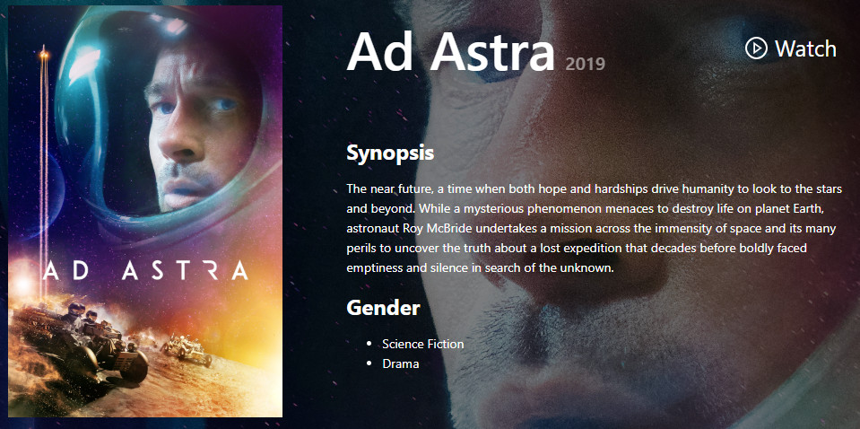

This project was created to show a films gallery, top popular movies and a general overview of any movie you choose in the home or if you find an specific movie using different endpoints of IMDb API, this project was made with react hooks, ant design and node sass.

## Available Scripts

In the project directory, you can run:

### `npm install`

This command installs all the required packages.  
Also you need to register on IMDb API to get the key and run succesfully this project. When you get the API, go to the /src/utils folder, open constants.js file and replace the api variable with your own key.
You must run this command before start the development mode. 
Then you write on the terminal npm run dev and open [http://localhost:3000](http://localhost:3000) to view it in the browser.

